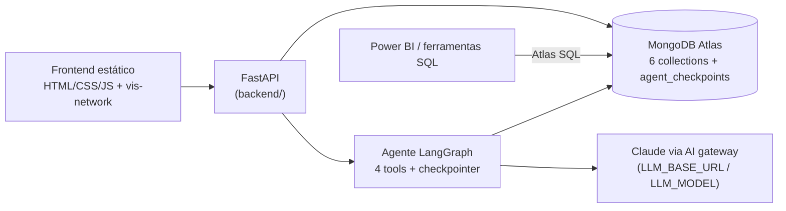

# Spectra

> **Engineering intelligence, decomposed.**

Protótipo público de uma plataforma de engineering intelligence modelada em **MongoDB Atlas**:
repositórios, componentes de arquitetura, áreas organizacionais, dependências e vulnerabilidades
de uma instituição financeira fictícia, navegáveis por uma UI web e por um **agente de IA em
português**. O projeto mostra como um modelo relacional rígido (EAV, tabelas de adjacência,
funções SQL de centenas de linhas) se transforma em documentos flexíveis, travessias de grafo
com `$graphLookup` e métricas materializadas.

Todos os dados são **100% sintéticos**, gerados por seed determinístico. Licença MIT.

## Três limitações do modelo relacional, três padrões no documento

| Limitação no modelo relacional | Padrão no documento | Onde ver |
|---|---|---|
| Atributos em EAV: três tabelas e dois JOINs para ler um único atributo | Campos nomeados dentro do documento (`attributes{}`, livre por documento) | módulo **Esquema Flexível** |
| Grafos em tabelas de adjacência, consultados com CTEs recursivas | Arestas dentro do nó (`relations[]`) + `$graphLookup` | módulos **Mapa & Grafo** e **Hierarquia e Análise de Esforço** |
| Métricas calculadas por função SQL de ~300 linhas a cada consulta | Computed pattern: objeto `analysis{}` materializado no documento | módulo **Dashboard** |

## Arquitetura



Um único runtime (Python + FastAPI) serve a API e o frontend estático. O modelo de dados tem
**6 collections** (`archComponents`, `areas`, `repositories`, `users`, `dependencies`,
`vulnerabilities`) organizadas em **dois grafos independentes**, fiéis à origem relacional:

- **Arquitetura**: componentes referenciam componentes (`relations[]`, arestas não-tipadas);
- **Operacional**: repositórios ligados a áreas, hierarquia de áreas (`parentId`) e responsáveis.

A versão .NET de cada repositório **não é um campo**: é derivada da dependência de runtime
(`Microsoft.AspNetCore.App 6.0.x` implica `net6.0`), como primeiro estágio do pipeline de impacto.

## Pré-requisitos

- **Python 3.12+** (testado com 3.12 e 3.13);
- Um cluster **MongoDB Atlas M10 ou superior, MongoDB 8.0+** (o seed cria os índices,
  incluindo o Atlas Search usado pela busca do agente);
- Para o módulo Copilot: credenciais de um endpoint compatível com a Anthropic Messages API
  (o seu AI gateway corporativo ou a API Anthropic).

Para criar o cluster: em [cloud.mongodb.com](https://cloud.mongodb.com), crie um projeto, um
cluster dedicado M10 com MongoDB 8.0+, um usuário de banco e libere o IP da sua máquina.
Copie a connection string (`mongodb+srv://...`) do botão *Connect*.

## Rodando em 4 comandos

```bash
cp .env.example .env        # 1. preencha MONGODB_URI (e, se quiser o Copilot, LLM_*)
pip install -r requirements.txt   # 2. dependências (use um virtualenv)
python seed/seed.py         # 3. gera e carrega os dados sintéticos + índices (idempotente)
uvicorn backend.main:app    # 4. sobe API + frontend em http://localhost:8000
```

A documentação interativa da API fica em `http://localhost:8000/docs`.

## Módulos

- **Visão Geral**: KPIs do portfólio (repositórios, frameworks, componentes, vulnerabilidades,
  áreas), com as agregações reais exibidas na própria tela.
- **Mapa & Grafo** (grafo de arquitetura): navegação visual dos componentes; clicar em um nó
  expande a vizinhança via `$graphLookup` e mostra o documento cru com `relations[]` em destaque.
- **Hierarquia e Análise de Esforço** (grafo operacional): a árvore organizacional inteira sai
  de um `$graphLookup` descendo `parentId`; a análise de impacto .NET percorre dependências →
  repositórios → áreas e acende as BUs afetadas na árvore, com esforço e responsáveis.
- **Esquema Flexível**: adicione um atributo ou relação a um componente (`$set`/`$addToSet`) e
  veja o documento mudar na hora, com as consultas de leitura re-executadas como prova: sem
  `ALTER TABLE`, sem migração de modelo, sem deploy.
- **Dashboard**: a visão de BI; cada repositório carrega o objeto `analysis{}` pronto
  (computed pattern) e a tela apenas lê, como o Power BI leria via Atlas SQL.
- **Copilot**: agente de IA em português (LangGraph + Claude) com 4 ferramentas curadas, que
  são as mesmas consultas das outras telas. O painel lateral mostra, ao vivo, as ferramentas
  usadas e a memória da conversa persistida no Atlas (`agent_checkpoints`).

Em todas as telas, os painéis "ver a consulta" exibem o comando MongoDB real que está rodando,
pronto para reproduzir no `mongosh` ou na sua aplicação.

## Configurando o Copilot

No `.env` (documentado em `.env.example`):

- `LLM_BASE_URL`, `LLM_API_KEY`, `LLM_MODEL`: endpoint compatível com a Anthropic Messages API
  (AI gateway corporativo ou API Anthropic). `LLM_PROTOCOL=openai` alterna para um endpoint
  OpenAI-compatible, se for o que o seu gateway expõe.
- `EMBEDDINGS_*` (opcional): com um serviço de embeddings configurado, a busca do agente vira
  híbrida (full-text + vetorial). Sem ele, a busca usa full-text via Atlas Search, sem nenhuma
  outra perda de funcionalidade.

Sem credenciais de LLM, o restante da aplicação funciona normalmente e o Copilot responde com
uma orientação de configuração.

## BI sem quebrar: Power BI via Atlas SQL

O documento `repositories`, com as métricas materializadas em `analysis{}`, é exatamente o que
uma ferramenta de BI passa a ler, via **Atlas SQL**, no lugar da antiga função SQL. O passo a
passo completo (instância federada, geração de schema, conector do Power BI e validação por
`$sql` no `mongosh`) está em [`docs/powerbi.md`](docs/powerbi.md).

## Caminho para produção em .NET

A modelagem do protótipo se transporta direto para uma stack .NET: o
[driver C# oficial do MongoDB](https://www.mongodb.com/docs/drivers/csharp/current/) e o
[provider do MongoDB para Entity Framework Core](https://www.mongodb.com/docs/entity-framework/current/)
executam as mesmas agregações e o mesmo `$graphLookup` mostrados nos painéis de consulta.
O FastAPI é apenas o runtime do protótipo.

## Desenvolvendo com IA

O repositório inclui `.mcp.json`, que conecta o
[MongoDB MCP Server](https://www.mongodb.com/docs/mcp-server/) a assistentes de código como o
Claude Code: com ele, o assistente inspeciona collections, valida pipelines e confere índices
diretamente no seu Atlas enquanto você evolui o projeto (defina `MONGODB_URI` no ambiente).
As [MongoDB Agent Skills](https://www.mongodb.com/docs/agent-skills/) complementam com boas
práticas de modelagem e consulta para o assistente.

## Dados sintéticos

O seed (`python seed/seed.py`) é determinístico (`Faker("pt_BR")`, semente fixa): rodar duas
vezes produz exatamente o mesmo resultado. Nomes de sistemas, pessoas, áreas e repositórios são
fictícios, plausíveis para um domínio de serviços financeiros genérico. O script dropa as
collections, reinsere tudo, valida a coerência referencial e cria os índices (regulares +
Atlas Search).

## Licença

[MIT](LICENSE).
